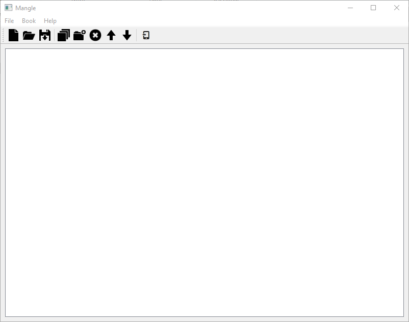

# mangas-to-kindle
Como converter mangas para formato .mobi para kindles.

# Tutorial
## Ferramentas
 ### Magle
-   Usado para converter paginas (images) para .cbz
-   Download: https://foosoft.net/projects/mangle/
 ### Kindle Comic Converter
-   Usado para converter de cbz para mobi
-   Download: https://kcc.iosphe.re/

## Passo a passo - Mangle

Primeira abra o mangle.exe

Após abrir clique em ``Add direcotry``

Uma nova aba irá ser aberto para escolha do diretorio que contem a pasta com os capitulos, no caso eu escolhi a pasta Kingdom (EXCELENTE MANGÁ).

Depois de selecionar a pasta o mangle deve exibir algo assim

Agora é a hora de converter as images/paginas para cbz.
Clique no icone de um celular, como a imagem demostra

Ao clicar no botão, uma caixa de opções deve ser aberta, nela você podera configurar o processode conversão, recomendo deixar igual na figura para um melhor resultado, mas se quiser modificar não se acanhe.

Depois de confirmar será requistado uma pasta para salvar o arquivo criado. Eu irei salvar no mesmo diretorio que está localizado o mangle.

Agora é só esperar pelo fim da conversão. Isso pode demorar já que depende do seu poder computacional.

## Passo a passo - Kindle Comic Converter

Abra o Kindle Comic

Clique em ``Add File``

Selecione o arquivo cbz

Agora clique em ``Convert`` 
(Lembre-se de colocar MOBI/AZW3)

Pronto conversão realizado com sucesso!

Agora seu manga está no formato .mobi e você pode utiliza-lo em seu Kindle!

